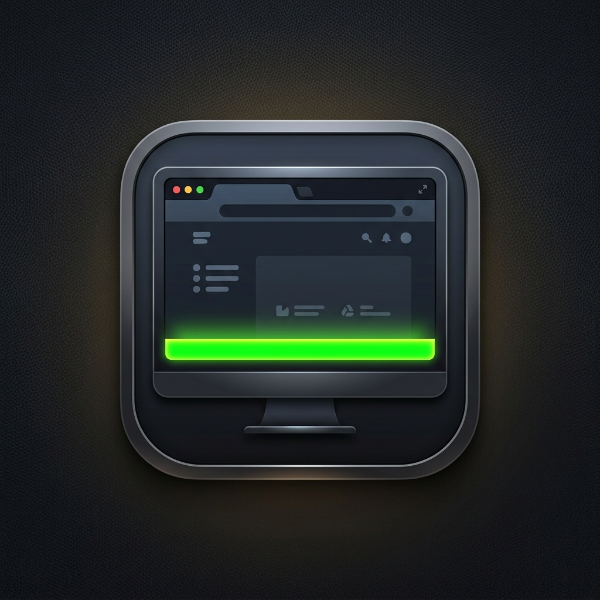
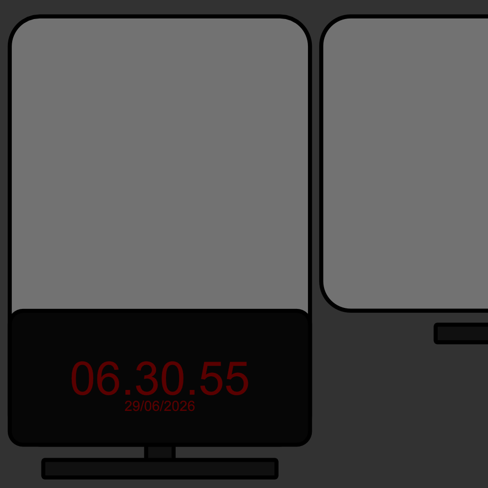
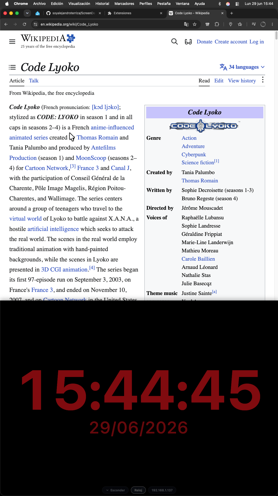
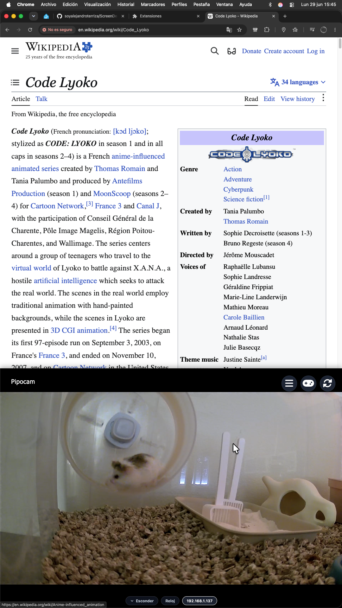

# Screen Dead Zone 🖥️🛡️

<p align="center">
  
</p>

<p align="center">
  
</p>

**Screen Dead Zone** es una extensión de Chrome de código abierto basada en **Manifest V3** diseñada para reservar, aislar y limitar una porción física de tu pantalla (zona muerta), evitando que el navegador renderice o exponga contenidos bajo ella. 

Es la herramienta perfecta para usuarios con pantallas con píxeles muertos en los bordes, configuraciones de monitores con marcos gruesos, o simplemente para quienes desean integrar widgets fijos (como relojes digitales) y cámaras de seguridad en tiempo real directamente en su espacio de navegación sin que la web se superponga sobre ellos.

---

## 📸 Capturas de Pantalla y Demostración

Para ver la extensión en acción, aquí tienes algunas capturas de la interfaz y un caso de uso real:

<p align="center">
  <b>1. Widget de Reloj Integrado (Anclado a la Izquierda)</b><br>
  
</p>

<p align="center">
  <b>2. Integración de Cámaras/Widgets mediante Iframe (Anclado a la Derecha)</b><br>
  
</p>

<p align="center">
  <b>3. Resultado IRL (En la vida real)</b><br>
  
</p>

---

## ✨ Características Principales

*   **📐 Ajuste de Medidas Dinámico:** Configura con precisión en porcentaje (de `0%` a `70%`) el tamaño que deseas reservar de tu pantalla.
*   **📍 Posicionamiento Multidireccional (Anclaje):** Permite anclar la zona muerta en cualquiera de los cuatro bordes de tu monitor: **Arriba (Top)**, **Abajo (Bottom)**, **Izquierda (Left)** o **Derecha (Right)**.
*   **🛠️ Dos Modos de Ajuste de Layout:**
    *   **Modo Redimensionar (Resize) [Recomendado]:** Modifica directamente el viewport (`html`) y aísla el scroll del navegador. Todos los elementos de posición fija (`position: fixed;`), como barras de chat, banners de cookies o menús flotantes, se desplazan hacia el centro automáticamente de forma nativa sin quedar ocultos.
    *   **Modo Espaciador (Spacer):** Añade un margen de relleno (padding) dinámico al borde de la página correspondiente para que puedas hacer scroll por encima de la zona muerta.
*   **🔌 Integración Iframe Eficiente:** Inserta cualquier página o stream web (como cámaras de seguridad locales a través de reproductores WebRTC/HLS tipo `go2rtc`, Scrypted o dashboards de domótica tipo Home Assistant).
*   **⚡ Rendimiento Inteligente (Lazy Loading & Destroy):** Para evitar el consumo excesivo de red, CPU y RAM en segundo plano, las pestañas inactivas o minimizadas destruyen por completo sus iframes de vídeo. Solo la pestaña activa y visible consume recursos reales del sistema.
*   **⏳ Widgets de Reloj y Fecha Integrados:** Muestra la hora actual en tiempo real con fuentes escalables de alta visibilidad cuando no uses una URL externa, adaptándose dinámicamente si la barra se dispone en vertical u horizontal.
*   **🎨 Personalización Total:** Configura el color de fondo, el color de los textos/reloj y guarda estas configuraciones como **Presets** rápidos de un solo clic.
*   **🍃 Minimizado Ágil (Botón Esconder/Mostrar):** Esconde temporalmente la Zona Muerta con un solo clic si necesitas el 100% de la pantalla para una tarea rápida, y recupérala al instante pulsando el botón flotante correspondiente en cada borde.
*   **🌐 Soporte Multilingüe (i18n):** Traducido de forma nativa a 8 idiomas: Inglés, Español, Portugués, Chino Simplificado, Hindi, Alemán, Francés y Japonés.

---

## 🚀 Instalación y Configuración

Sigue estos sencillos pasos para instalar la extensión de forma manual en tu navegador:

1.  **Descarga el código del repositorio:**
    *   Descarga el código como `.zip` y descomprímelo en tu ordenador, o clona el repositorio usando Git:
        ```bash
        git clone https://github.com/soyalejandroterriza/ScreenDeadZone.git
        ```
2.  **Abre la página de extensiones en Chrome:**
    *   En la barra de direcciones de tu navegador, introduce `chrome://extensions/`.
3.  **Activa el Modo de Desarrollador:**
    *   Activa el interruptor **"Modo de desarrollador"** situado en la esquina superior derecha.
4.  **Carga la extensión:**
    *   Haz clic en el botón **"Cargar descomprimida"** en la esquina superior izquierda.
    *   Selecciona la carpeta raíz del proyecto (donde se encuentra el archivo `manifest.json`).
5.  ¡Listo! Abre el menú pulsando en el icono de **Screen Dead Zone** en la barra de herramientas de extensiones de tu navegador para configurarlo.

---

## 🔌 Compatibilidad con Iframes

Screen Dead Zone permite cargar cualquier página o recurso web directamente dentro de la zona muerta utilizando iframes. Esto es sumamente útil para integrar en tu espacio de trabajo:

*   **Dashboards de control:** Paneles de domótica (como Home Assistant), paneles de monitorización o gráficas en tiempo real.
*   **Herramientas de productividad:** Calendarios compartidos, gestores de tareas en línea o reproductores multimedia web.
*   **Recursos locales:** Web apps locales, cámaras de seguridad locales y cualquier contenido que se pueda visualizar a través de un navegador.

---

## 📁 Estructura del Proyecto

```text
├── icons/             # Iconos oficiales de la extensión
├── _locales/          # Traducciones oficiales del proyecto (i18n)
├── background.js      # Script de servicio de fondo (Persistencia y broker de mensajería)
├── content.js         # Script inyectado en las páginas web (Gestión de estilos, DOM, cálculo de bounds y eventos)
├── manifest.json      # Definición de la extensión (Manifest V3)
├── popup.html/js/css  # Ventana de activación rápida que abre la interfaz de configuración
├── test_page.html     # Página interactiva local para verificar que todo se redimensiona bien
├── Screenshots/       # Capturas de pantalla para la documentación
├── thumbnail/         # Imagen miniatura del repositorio
└── README.md          # Documentación del proyecto
```

---

## 🛡️ Licencia

Este proyecto está bajo la Licencia MIT. Consulta el archivo `LICENSE` (si corresponde) para obtener más información.
